
<h1 align="center">基于SpringBoot的论坛系统设计与实现</h1>

## 简介
基于SpringBoot开发的论坛系统：角色包括管理员和用户；提供论坛管理、留言板发布、版主管理、用户信息编辑等功能，界面简洁直观，支持帖子搜索与互动交流，增强社区互动。    --计算机毕业设计源码；毕设源码；java毕业设计源码

## 联系方式

<h3 align="center">获取完整代码与数据库文件 + 微信：deepguan QQ: 86050149 QQ群: 783742310</h3>

<h3 align="center">可帮忙远程部署 包运行成功！提供远程部署、修改代码、设计文档指导、代码讲解等服务！</h3>

## 功能介绍（完整见运行截图）
管理员：  
基本功能包括登录、注册和注销。主界面提供主页访问、个人中心模块和论坛管理功能，支持查询和筛选论坛信息。后台管理功能涉及用户信息、版主管理和基础数据管理，可以进行添加、修改和删除操作。提供帖子和留言的管理，包括搜索、查看详情和回复功能，便于维护和优化论坛内容。

版主：  
拥有权限管理版块内容和用户评论。可以通过提供的搜索功能根据用户和帖子信息快速获取所需内容。页面可进行版主信息的修改，包括账号、姓名、邮箱和联系方式。支持头像上传并能够回复用户留言，维持版块秩序和内容更新。

用户：  
能够进行注册、登录等基本功能。主页包含导航栏用于快速访问首页、论坛和留言板等模块。可以在线发表留言和帖子，并对帖子进行评论和回复。个人中心允许用户查看和修改个人信息，头像上传功能可个性化设置资料。

访问者：  
无需登录即可浏览论坛主页和新闻信息。通过导航选项能够轻松访问论坛、留言板以及查看最新动态和留言内容。具备查看权限但需注册以执行留言、发帖和回复操作。旨在提供简洁直观的浏览体验以吸引新用户注册和参与。

## 运行截图
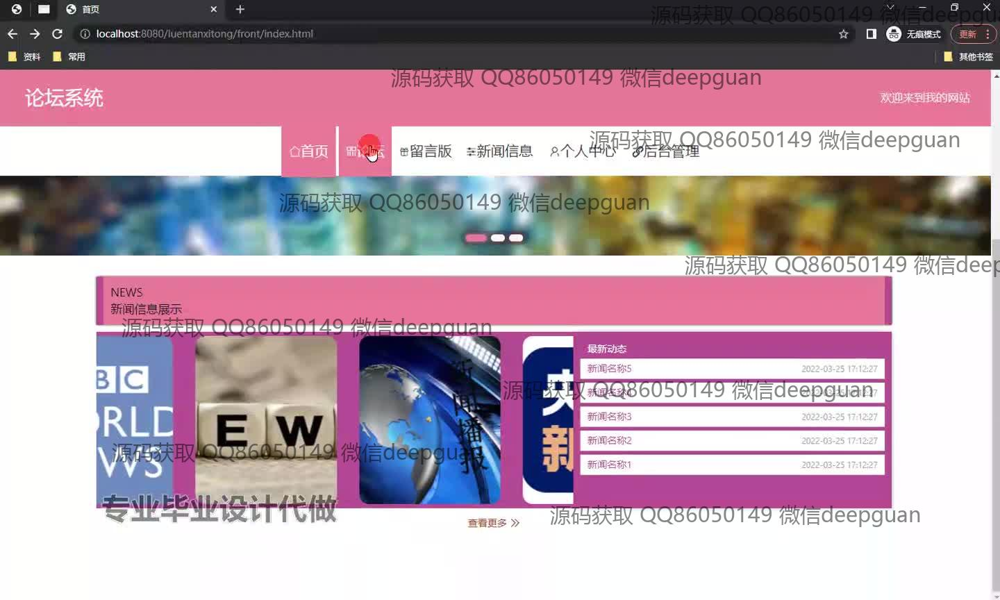
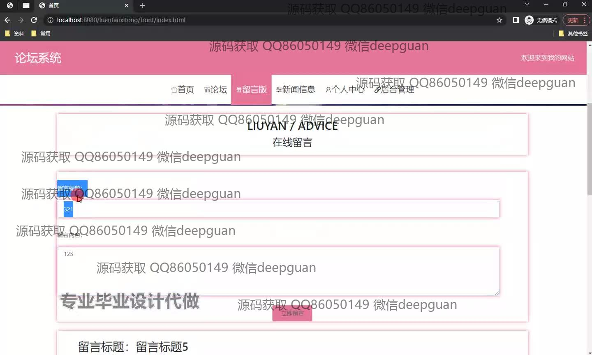
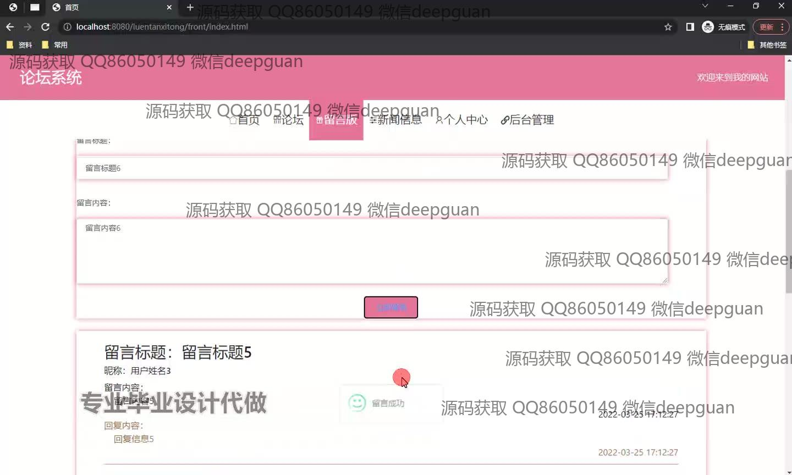
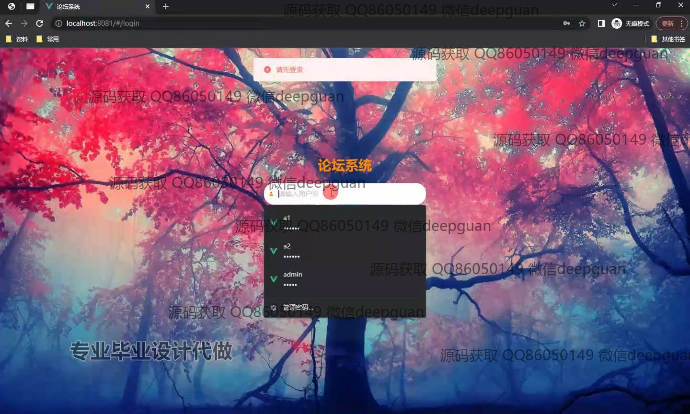
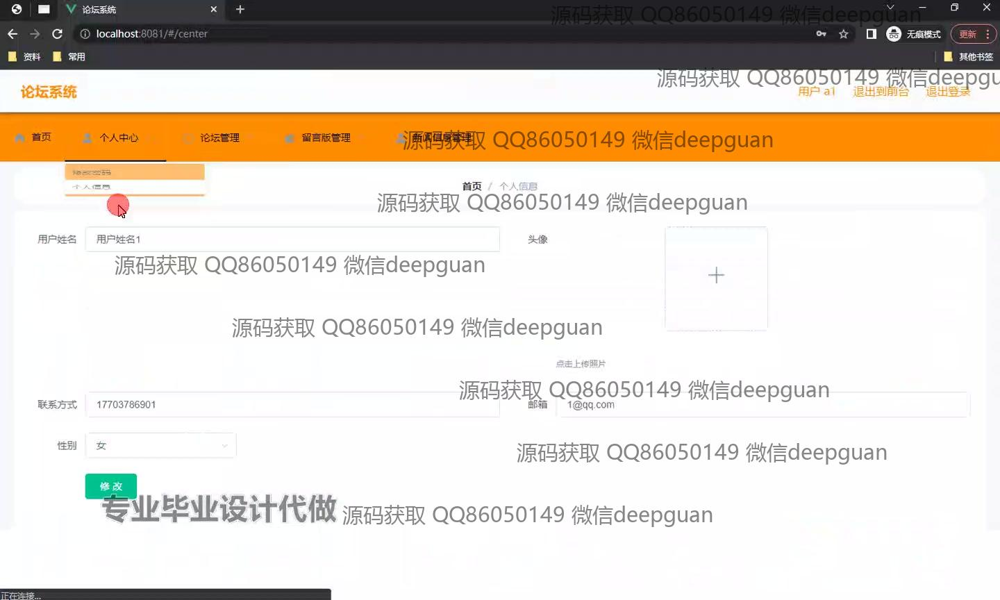
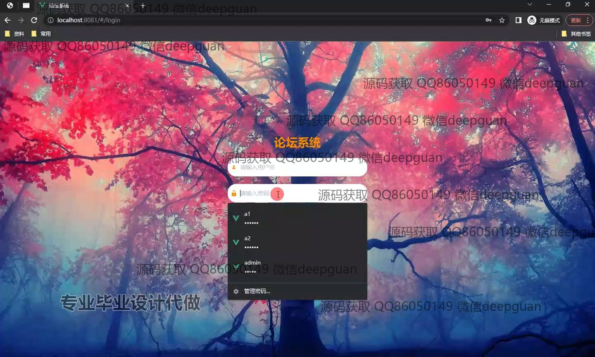
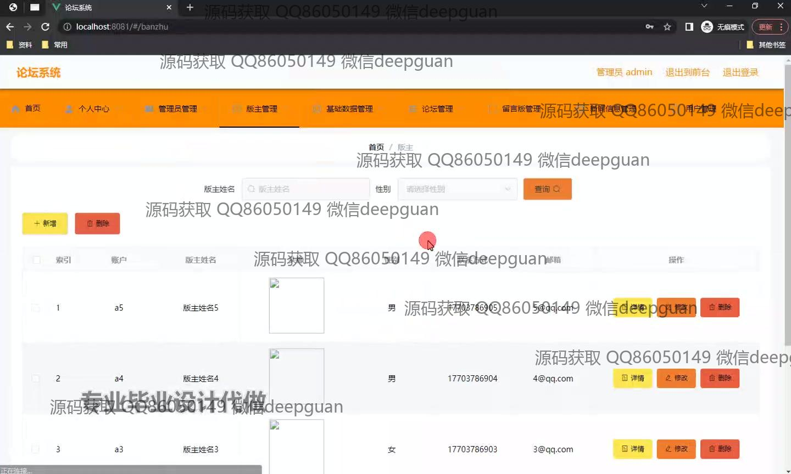
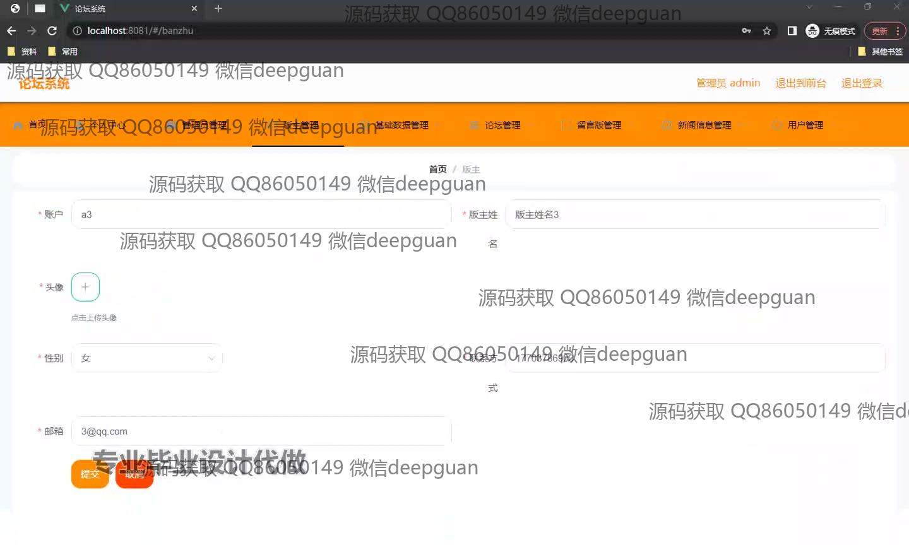
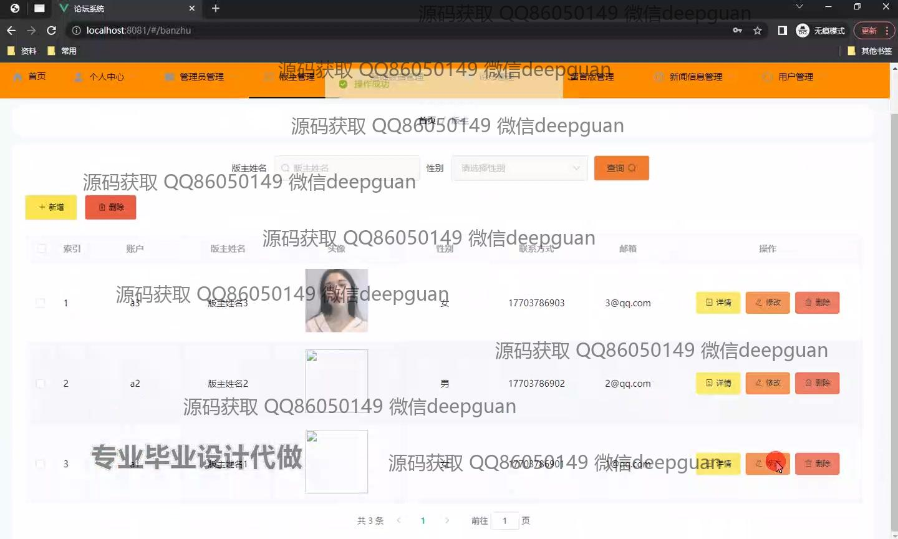
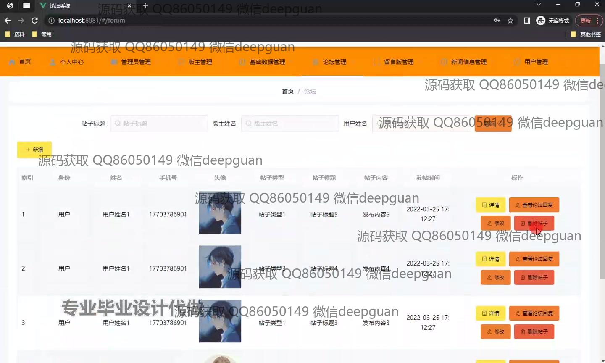
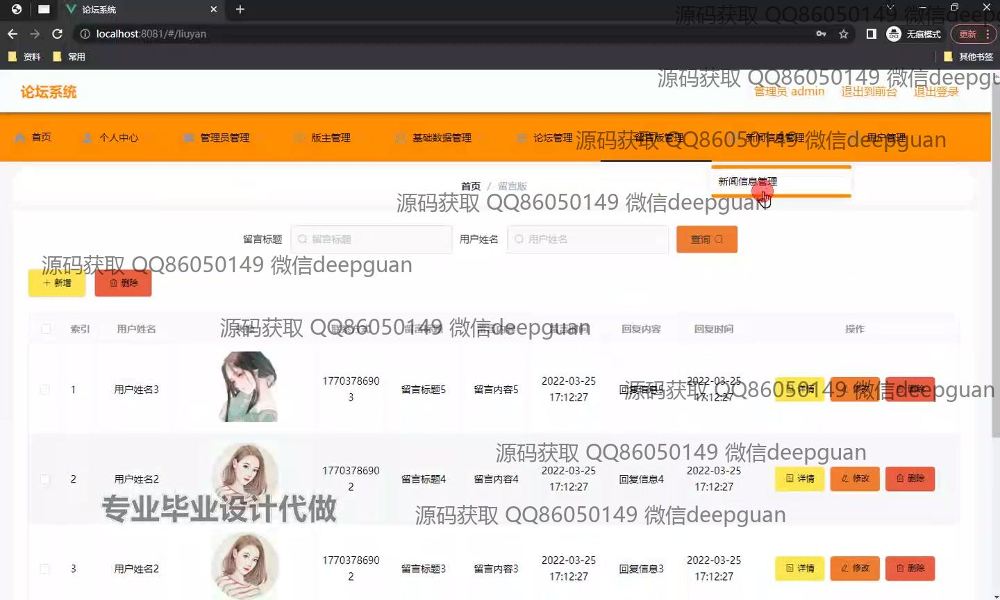
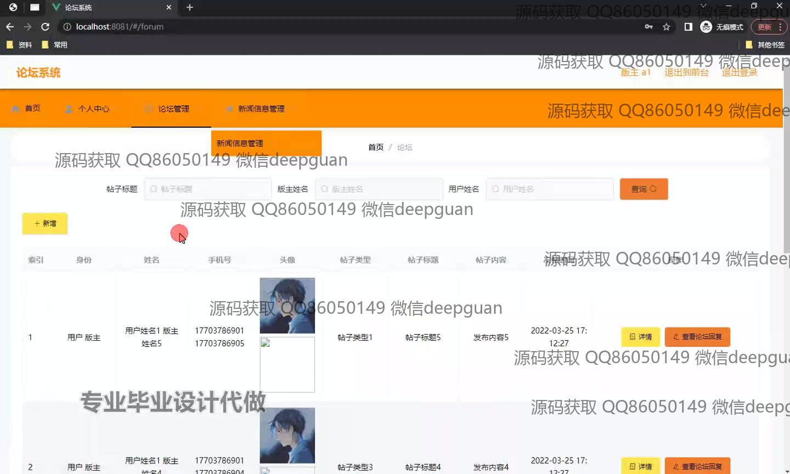
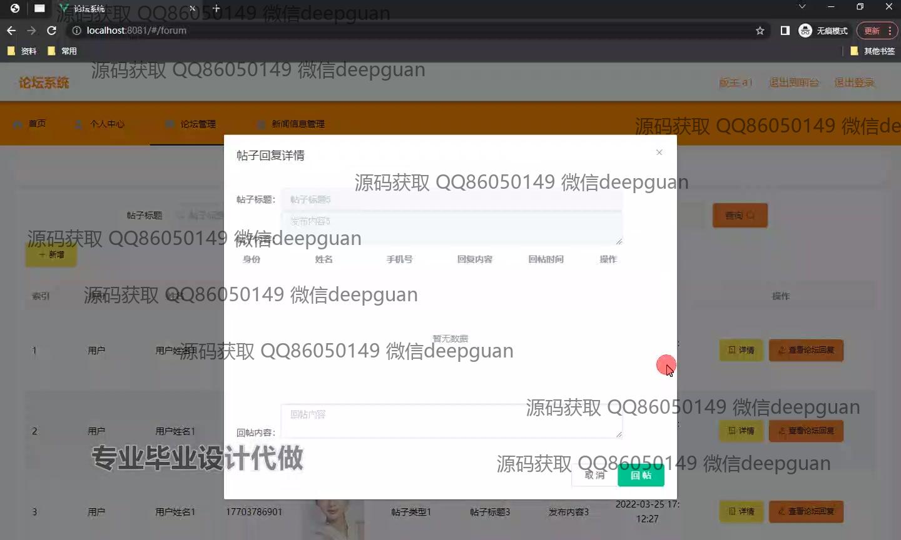
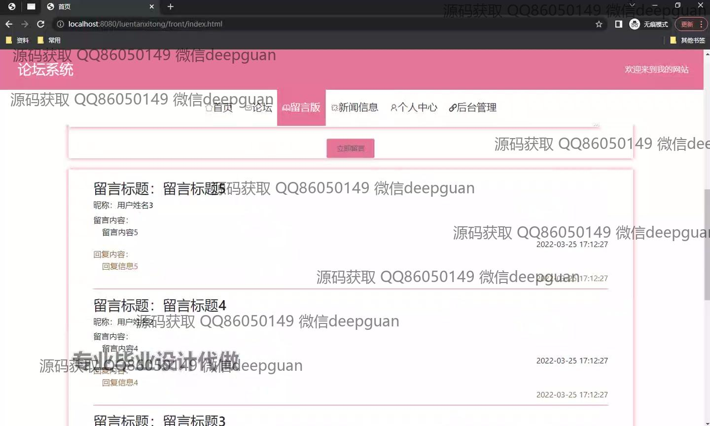

本代码来源于网络,仅供学习参考使用!

